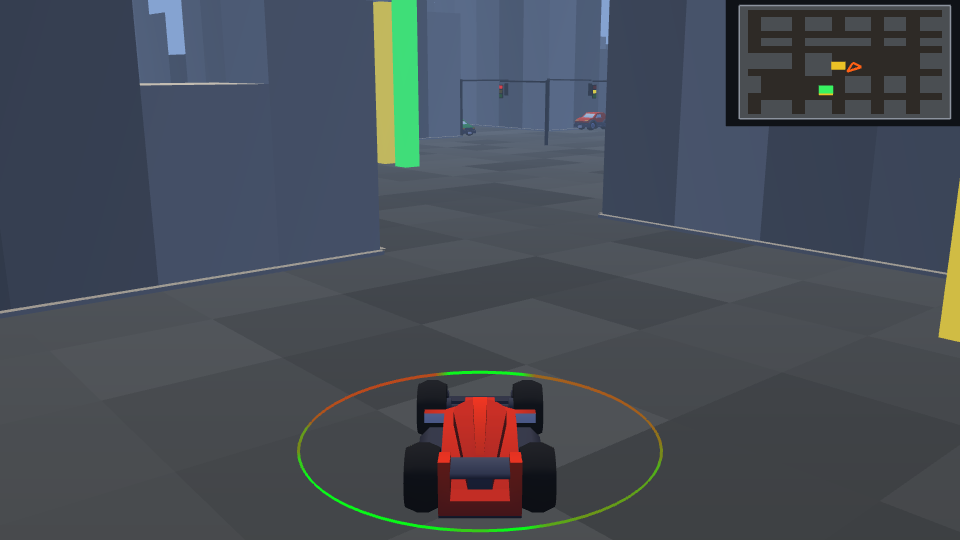
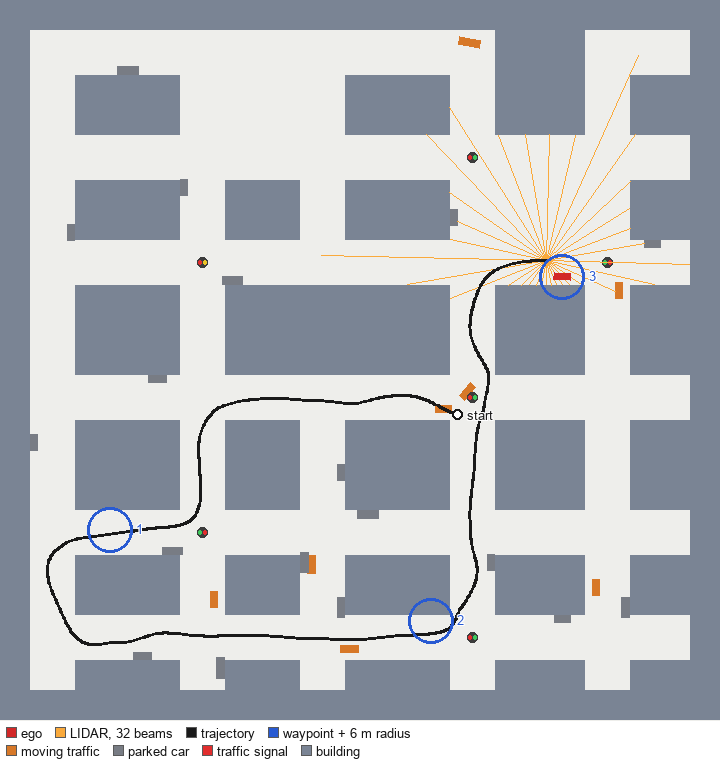
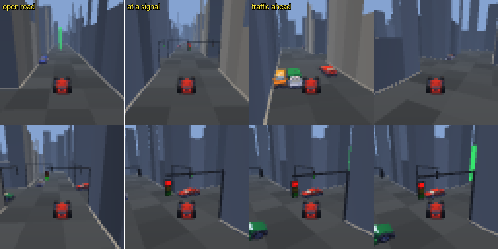
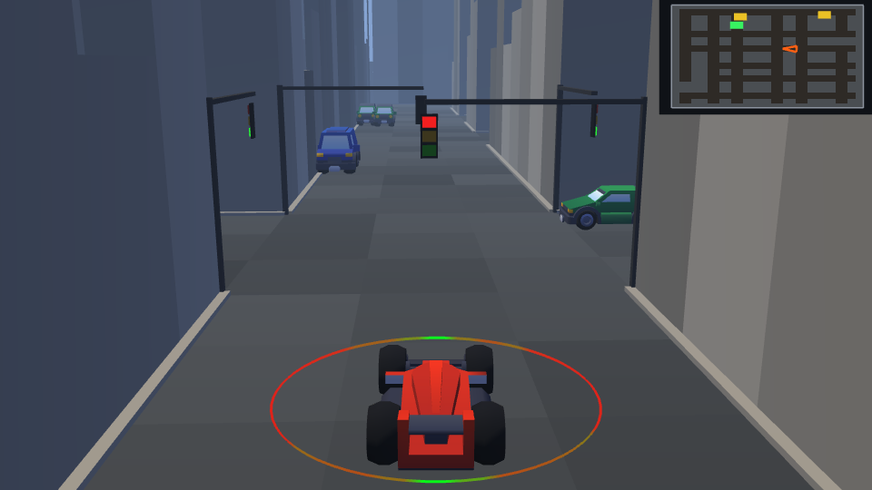
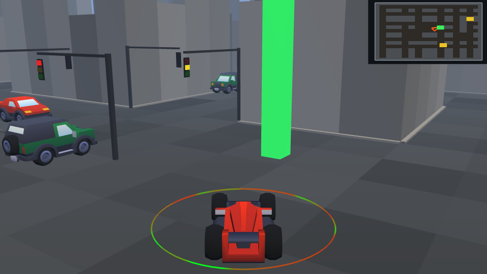

# rl-env3d — a 3D car navigation environment for RL and world models

A procedurally generated city that a car has to navigate through a sequence of
waypoints. Built as a successor to the PNG-bitmap 2D environment in `../RL-t3d`,
with the specific goal of supporting **both** vector and image observations so
world-model experiments are not forced to choose.



*Chase view at 960×540. The green post is the next waypoint, the ring around the car
is colour-coded by LIDAR range in that direction, and the inset is the minimap. The
signal gantry and two crossing vehicles ahead are the traffic layer. Every figure in
this README is regenerated by `python tools/figures.py`.*

```
python main.py spec           # observation / action contract
python main.py demo           # live window, scripted driver, LIDAR overlay
python main.py demo --keys    # same but drive it yourself (arrow keys + brake)
python main.py serve          # live browser viewer at http://localhost:8765 (needs websockets)
python main.py bench          # throughput, vector vs image
python main.py shots          # save a grid of 64x64 agent-view frames
python tools/figures.py       # regenerate every figure in this README
```

**Writing a learner against this env? Read [INTEGRATION.md](INTEGRATION.md).** It is
the contract an outside algorithm depends on — observation slices, reward
decomposition, `terminated` vs `truncated`, the seeding guarantees, vectorisation —
and every claim in it is enforced by `tests/test_integration.py`. This README
explains *why* the env is built the way it is; that one tells you how to consume it.

```python
import carnav
env = carnav.make()                                    # 73-D vector obs
env = carnav.make(traffic=False, traffic_lights=False)  # 46-D, the plain nav task
```

## Why this exists

The old environment gave a 9-dimensional state: seven binary "is there road at
this one pixel" sensors, plus a target angle and distance. That is enough to
learn *something*, but it cannot express how far away a wall is, so a policy can
only ever react once it is already on top of one. Its collision test was a single
centre pixel, so the car could clip a building corner and drive on.

The design brief here was: **the vector observation must be dense enough to
replace the image entirely**, because rendering was what made DreamerV3
impractical on the old env — while still being able to render properly when you
want pixels.

Both paths are live, and the cost of each is measured (see Performance).

## Layout

| path | role |
|---|---|
| `env/world.py` | procedural city grid, ray casting, collision, spawn sampling, signal placement |
| `env/car.py` | kinematic bicycle model with a rate-limited steering actuator |
| `env/sensors.py` | 360° LIDAR, ego-centric nav and proprioception features |
| `env/traffic.py` | on-rails moving vehicles and kerbside parked cars |
| `env/nav_env.py` | Gymnasium-style env: observations, reward, termination, traffic-light state |
| `render/panda_renderer.py` | Panda3D third-person renderer (offscreen or windowed) |
| `carnav.py` | the public surface: `carnav.make(**flat_kwargs)`, `make_factory`, `gym.make` ids |
| `baselines/scripted.py` | follow-the-gap + pure-pursuit driver, obs-only |
| `tests/` | core, env, render and integration suites, plus two diagnostic scripts |
| `tools/figures.py` | regenerates every figure in this README into `docs/` |
| `INTEGRATION.md` | the contract for algorithm implementers |
| `kenney_car-kit/` | CC0 low-poly vehicle assets (Kenney.nl); only used by the renderer |

The renderer is **injected**, never imported by the simulation. Headless training
never loads a graphics stack — verified by installing an import hook that makes
`panda3d`, `direct` and `PIL` raise, then running a full episode: it completes with
zero graphics modules in `sys.modules`. Gymnasium is optional too — there is a small
`Box` shim so the env works without it — but when it *is* installed,
`gymnasium.utils.env_checker` passes with zero warnings, and `AsyncVectorEnv`,
`RecordEpisodeStatistics` and `FrameStackObservation` are covered by
`test_integration`.

## The task



*One complete episode, plan view — seed 5053, 997 steps, all three waypoints reached
by the scripted baseline. The blue circles are the waypoints with their 6 m capture
radius drawn to scale; note how small that is against the ~40 m hops between them,
which is why waypoint bonuses cannot chain. The orange fan is the actual 32-beam
LIDAR scan at the final pose — the same 32 numbers that occupy `obs[0:32]`. Drawn
from `env.targets`, `env.traffic`, `env.traffic_lights` and `lidar.last_distances`
directly, so it needs no renderer and cannot disagree with the observation.*

The map is resampled every reset, so this is one draw from the distribution, not
*the* map — which is the whole reason no absolute position appears in the
observation. Drawn at 48×48 tiles (192 × 192 m) to match the figures and the
baseline table; the `CityConfig` default is 64×64.

## Observation

`obs_type` selects `"vector"`, `"image"` or `"both"`.

**Vector — 73 dimensions, all in [-1, 1], entirely ego-centric:**

| block | dims | contents |
|---|---|---|
| LIDAR | 32 | full 360°, 60 m range, normalised. Beam `n/2` is straight ahead, so the array's wrap-around discontinuity sits at the rear where it carries least information. Parked and moving vehicles are in the scan, so the ranges already describe them as geometry. |
| dynamics | 5 | speed, yaw rate, **steer angle**, acceleration, slip angle |
| navigation | 9 | next 3 waypoints × (distance, sin, cos) of bearing |
| traffic light | 7 | nearest signal: distance **to the stop line**, sin/cos bearing, red/yellow/green for *this car's approach axis*, steps until the phase changes |
| traffic | 20 | nearest 4 **moving** vehicles × (distance, sin/cos bearing, relative velocity in the ego frame) |

The traffic block exists for **the velocity alone**. LIDAR already reports where
the metal is and roughly what shape it has, but a single scan cannot say whether
the car ahead is stopped or doing 10 m/s away from you, so without velocity the
observation is not Markov for anything involving traffic — the same argument that
puts `steer_angle` in the dynamics block. Parked cars are deliberately *absent*
from it: their velocity is always zero, so they would fill the nearest-4 slots
with nothing LIDAR does not already carry. They are static geometry, no different
in kind from a wall.

Two switches shrink it, and each drives the simulation, the observation *and* the
rendered geometry together:

| config | dims | vehicles |
|---|---|---|
| defaults | 73 | 26 (8 moving) |
| `traffic_lights=False` | 66 | 26 (8 moving) |
| `traffic=False` | 53 | 0 |
| both off | 46 | 0 — the original task |

Turning lights off also disables
the red-light penalty, because penalising a signal the agent cannot see is not a
rule it can learn.

Because those widths move, **never hard-code the block offsets** — read
`env.obs_slices`, a name→slice mapping that is the single source of truth and the
same numbers `main.py spec` prints. A switched-off block is present as an *empty*
slice rather than missing, so `obs[sl["traffic"]]` is always valid. This is not
hypothetical tidiness: the scripted baseline already mis-read the traffic-light
block once by taking "the rest of the vector".

There is no absolute position or heading anywhere in the observation, which is
what lets a policy trained on one procedural layout transfer to the next instead
of memorising coordinates.

Three details that matter more than they look:

- **`steer_angle` is included** because the front wheels lag the command through
  a rate-limited actuator. Without it the observation is not Markov, and the
  agent cannot learn to anticipate turn-in delay.
- **Angles are sin/cos pairs**, never raw radians, so the network never sees the
  discontinuity at ±π.
- **Absent waypoints are padded with `sin = cos = 0`** — not a valid unit vector,
  so "no waypoint" is unambiguously distinguishable from every real bearing.

**Image** — 64×64×3 uint8 by default, third-person chase camera.



*Eight image observations at their native 64×64, upscaled 4× with nearest-neighbour
so the actual pixels are visible. This is the entire input in `obs_type="image"`.*

Worth looking at closely, because it is the argument for the vector path: at 64×64
the red signal in panel 2 is **about four pixels**, and the relative velocity of the
car in panel 3 is not present at all — a single frame cannot contain it. A policy on
pixels has to recover from a handful of pixels, across a frame stack, what
`obs[46:53]` and `obs[53:73]` hand over directly. Both paths are supported and
measured; only one of them is cheap.

## Action

`Box(-1, 1, (3,))` → throttle, brake, steer. Throttle and brake are rescaled to
[0, 1]; steer is a *command*, not an angle, and passes through the rate limiter.
Braking cannot reverse the car.

## Reward

`progress × 1.0` toward the current waypoint, `−0.1` per step, `+100` per
waypoint reached, `−100` for a crash — into a building or a vehicle alike, with
`info["crash_with"]` saying which — and `−50` for entering an intersection
against a red.

Every step's reward is exactly `time + progress + waypoint + red-light + crash` and
nothing else — reconstructed from `info` alone and checked against the env's own
reward to a maximum residual of **7.1e-15**, over 18,363 steps per `test_integration`
run and 59,254 steps in the wider audit that established it (172 waypoint hits, 86
red-light violations, 85 crashes). Progress is potential-based, so it
telescopes to net distance closed and there is no reward cycle in driving out and
back. `tests/test_integration.py` keeps it that way.

Early termination on "stuck" charges the *remaining* time penalty as a lump sum, so
ending an episode early is **undiscounted**-return-neutral (verified: −100.0 either
way). Otherwise stopping dead would be a cheap way to escape the per-step cost, and
the agent would learn to park. The honest caveat is that under γ < 1 a lump sum paid
now is worth more than the same penalties spread over 900 future steps, so
discounted, getting stuck is strictly worse than crawling — deliberate shaping, and
`stuck_steps=0` turns the detector off if it is in your way. It is reported as
`terminated`, not `truncated`, precisely because the lump sum *replaces* the
`V(s')` bootstrap; taking both would double-count the future.

The red-light penalty fires **on entry only, never per step of occupancy**. A
light that turns red while you are already in the box is not a violation, and
charging per step would make a single mistake unboundedly expensive — the agent
would learn to fear intersections rather than to read signals.

Which signal you are judged against is decided by **the stop line you crossed**,
not by where you were pointing (see Design decisions).

## Visualisation

### Live browser viewer

`python main.py serve` runs one env in real time and streams its state to a
Three.js page at <http://localhost:8765>. The simulation stays in Python; the
browser only draws. Nothing graphical is imported on the server, so it runs on a
headless training box: start it there with `--host 0.0.0.0` (or tunnel with
`ssh -L 8765:localhost:8765 box`) and open the page on your laptop, which does the
rendering on its own GPU. Needs `pip install websockets` (the `viewer` extra).

The page shows a chase / aerial / driver camera, front / left / right / rear
camera feeds, the LIDAR fan and a per-sector radar readout, the scripted driver's
intent and the speed cap that binds it, the reward and its components, a minimap
and a 60 s decision timeline. Space pauses, `.` single-steps while paused, R
restarts the same seed, N draws a new map, M toggles manual driving (arrow keys),
V cycles the view, O toggles the sensor overlays; traffic density and sim rate are
in the top bar. `tools/viewer_shot.py` screenshots the running page headlessly
(Playwright), for checking the render from a box with no display.

### Panda3D window

`main.py demo` opens a Panda3D window with three layers:

**3D chase camera** — third-person view following the car.  The car mesh is a
Kenney CC0 sedan scaled to match the physics car (≈ 4.4 m long).  The green
beacon posts mark the next waypoints; the brightest one is the current target.
Fog hides the map boundary and gives depth cues.

**Traffic signals** — six crossings per map carry lights, and each signalised
crossing gets **four separate signal heads, one per approach**, hung from a mast
arm that reaches out over the corridor so the head sits above the stop line
facing oncoming traffic. A single pole on one corner (the first attempt) shows
its edge or its back from most approaches and cannot be read at all from two of
them, which made the light unreadable exactly when it mattered. The lens stands
proud of its backplate so the driver sees a full lit face rather than a sliver.



*The stop-line decision. The head facing us is red; the heads on the cross-street
gantries show green, because the phase belongs to the other axis. This frame was not
chosen by stepping to a fixed step number — `tools/figures.py` searches 60 episodes
for the frame that best satisfies "the nearest signal is red, within 30 m, and
ahead", read out of `obs[46:53]`. The figure therefore keeps showing the thing it
claims to, rather than rotting the next time a random stream shifts.*

**Traffic** — moving vehicles and kerbside parked cars, drawn from the Kenney CC0
kit with `instanceTo` so ten body types cost one mesh each. The *physics* footprint
is authoritative: each mesh is measured with `getTightBounds()` and scaled to the
length the simulation uses, so a van looks as long as it collides. Moving vehicles
hold a lane 3 m right of the corridor centre and parked cars hug the kerb facing
the direction traffic flows on that side, which is what makes a parked car read as
parked rather than abandoned.



*Traffic at a signalised junction, with a waypoint post beyond it. Only the **moving**
vehicles occupy slots in `obs[53:73]`; the parked ones are deliberately absent from
that block, because their velocity is always zero and LIDAR already reports them as
geometry. Filling the nearest-4 slots with kerbside furniture would crowd out the
vehicles that can actually hit you.*

**Minimap (top-right corner)** — a top-down view of the full city.  Buildings
are warm grey, road is dark blue-grey.  Elements:

| element | meaning |
|---|---|
| orange triangle | car — tip = nose, tail = rear |
| bright green square | current target waypoint |
| yellow squares | upcoming waypoints (in order) |

**Proximity ring (3D, default on in windowed mode)** — a ring of radius 3 m
around the car in the 3D scene.  Each segment is coloured by the LIDAR
distance in that direction: **green** = clear, **red** = obstacle close.
This gives an at-a-glance danger signal without cluttering the minimap.
The LIDAR ray lines are reserved for future use (e.g. visualising a world
model's imagined scene in a separate overlay).  Set `show_rays=False` to
suppress the ring; it is off by default in offscreen (training) mode so it
never enters image observations.

**Camera picture-in-picture (front / left / right)** — three extra corner
thumbnails, each its own offscreen-rendered camera (front dash-cam, left/right
wing-mirror-style views), composited onto the main window the same way the
minimap is: a live texture on a bordered card. Set `show_cameras=False` (or
`--no-cameras` on the CLI) to turn them off; like the ring and the minimap
they default off for offscreen/training renderers.

**Dashboard HUD** (`render/hud.py`) — dark cockpit-style panels reading
straight off `env`/`info`: a big speed readout, an episode-reward panel with
the live time/progress/target/red-light/crash breakdown (`info["reward_
components"]`), and a sensors panel combining the LIDAR closest-obstacle
reading with a per-sector **radar** readout (`env.radar` — nearest moving
vehicle per compass sector, with distance and closing speed in km/h) and a
countdown to the nearest traffic signal's next phase change. Colors and panel
styling come from `render/theme.py`, shared with the restyled minimap and
LIDAR ring.

**Keyboard controls** (`--keys` flag):

| key | action |
|---|---|
| ↑ arrow | throttle |
| ↓ arrow | brake |
| ← / → arrow | steer left / right |

The scripted driver runs when `--keys` is not set.  Both use the same 73-D
observation vector — no privileged simulator access.

**Offscreen vs windowed** — when `offscreen=True` (training), the minimap
overlay is suppressed so it never enters the image observation.

## Performance

Measured on this machine, 48×48 tile map, 32 beams. Configs are **interleaved and
best-of-6**, not swept in order: a sequential sweep drifts with thermal state
enough that a config touching no changed code once appeared to regress by 20%.

| | µs/step | steps/s |
|---|---|---|
| vector, no traffic | ~212 | **~4,700** |
| vector, traffic on | ~410 | **~2,440** |
| vector + 64×64 image | ~565 | **~1,750** |

Ray casting is the bulk of the traffic-free vector step (~158 µs of ~212 µs). Map
generation is ~2.7 ms per reset and rebuilding the render mesh is ~10 ms.

**Traffic lights cost the vector path nothing measurable**: 216 µs/step with them
off versus 212 µs with them on, inside run-to-run noise.

**Traffic costs 1.93×**, and the breakdown is the interesting part:

| | µs/step vs traffic off |
|---|---|
| `traffic=True`, zero vehicles | +0 |
| 18 parked cars | +36 |
| 8 moving vehicles | +192 |

So it is not the sensing. Eighteen parked cars are 54 circles in the LIDAR and cost
36 µs; eight moving vehicles are 24 circles and cost 192 µs, because what they
actually cost is the *controller* — routes, signals, the junction reservation and
car-following, evaluated every step. At eight vehicles that is dominated by fixed
numpy call overhead rather than by anything that scales, so the figure is roughly
flat in vehicle count. Resets go from 2.7 ms to 10.2 ms for the same reason: route
generation is 900 m of 1 m polyline per vehicle, which amortises to ~18 µs/step
over a typical episode.

This is checked rather than assumed, because the whole premise of the env is that
the vector path stays fast enough to train on — a throughput regression there is a
correctness problem, not a performance nit. The point that mattered is that
**`traffic=False` is unchanged at ~212 µs**, matching the pre-traffic figure, so the
original task did not get slower; and even with traffic the vector path is ~6.5×
the image path, which is the comparison the design brief was about.

## Design decisions worth knowing

These were all forced by measurement rather than chosen up front.

**Corridor width is set by the car's turn radius.** `road_width=3` (12 m), not 2
(8 m). The minimum turn radius is 4 m, so a U-turn needs about 9.9 m of width
including the body. At 8 m, any episode whose target spawned behind the car was
geometrically unwinnable. Set it to 2 for a deliberately much harder env.

**Spawn poses must be able to drive away, not merely not collide.** The heading
is aligned with the roomiest probed direction and then jittered — but the probe
is a centre-line ray that ignores the car's 1.9 m width, and the jitter is
applied *after* it. So the accepted pose is additionally required to have 6.6 m
of *swept* forward room. Before this check, 1% of episodes crashed within 1 m of
the spawn no matter what the policy did, which poisons training with
unavoidable negative returns.

**The fast ray caster is corner-safe.** Sampling a beam every 0.25 m is 2.7×
faster than exact DDA traversal, but a beam grazing a convex building corner
crosses only a few centimetres of that tile, so no sample lands inside and the
wall is missed entirely — 0.2% of beams reported ~20 m of clearance where the
true range was 6 m. Since the tile is a full building, a car driving down that
beam crashes; the sensor would have been punishing the agent for trusting it.
The sampler now identifies the skipped cell the same way DDA does, by comparing
distance-to-vertical-boundary against distance-to-horizontal. Agreement with
exact DDA is within ±step/2 over 57,600 rays, asserted in `test_core`.

**Collision is an oriented bounding box**, 4 corners + 4 edge midpoints. On 4,000
poses whose centre sits on road, the OBB catches ~1,000 that a centre-point test
would have driven straight through.

**The chase camera is stateless.** No smoothing, so `capture` is a pure function
of car pose. Smoothing looks better but makes the image depend on history, which
silently breaks both determinism under a fixed seed and the Markov property the
vector state works hard to preserve. `--smooth` exists for watching, not
training; `test_render` asserts byte-identical frames across two runs of a seed.

**The road is drawn as one quad per tile, not one big plane.** A featureless
plane is cheaper but gives a vision policy almost no optical flow, which makes
speed nearly unobservable from pixels — exactly the signal an image-based world
model needs. Per-tile shading costs ~1k extra quads.

**Every road tile is reachable.** Generation flood-fills, keeps the largest
connected component and walls off the rest, so a sampled target is never
unreachable from a sampled spawn.

**Right-of-way is decided by the stop line crossed, not by heading.** The obvious
implementation asks which way the car is pointing (`|sin h| > |cos h|`) and reads
the N-S or E-W phase accordingly. On a 12 m undivided corridor with no lane
markings and no drive-on-side convention there is no well-defined "lane", so a
car cutting a corner sits near 45° and that test becomes a coin flip: measured at
**7% of real entries, with 11% within 20° of the boundary**. A penalty that is
noise on 7% of the events it fires for is not a rule anything can learn. The
axis is now taken from *which stop line the car crossed* — whether it was
previously outside the box in x or in y — which is unambiguous and is fixed at
exactly the moment the penalty is evaluated. The two rules disagree on 8% of
entries, and the observation now agrees with the reward on **100% of measured
violations**.

**Yellow is as long as it takes to stop, not as long as looks right.** Stopping
from the 10 m/s cruise speed at the controller's 6 m/s² takes 1.67 s and 8.3 m.
Yellow was originally 12 steps (0.6 s) — 2.8× too short — which means the warning
was one the vehicle *physically could not honour*, so yellow was decoration and
every driver arriving on one was guaranteed a −50. It is now 40 steps (2.0 s).
Timings in an RL env are set by the vehicle's physics, not by realism.

**Waiting at a red is exempt from the stuck detector.** A red lasts
`GREEN + YELLOW` steps, so without the exemption the signal cycle and the
stuck timeout are silently coupled and a long enough cycle terminates the episode
**for obeying the law**. The original settings had only 58 steps of margin — not
a bug yet, but one retune away from being one.

**Only six crossings per map are signalised**, chosen greedily farthest-first out
of the ~31 true 4-way junctions. Every 4-way sits ~29 m from the next, so
lighting them all against a 14 s cycle makes a drive stop-go every 3 s with no
rhythm to learn — constant friction rather than a skill. Sparse placement raises
the mean spacing to ~72 m and makes each signal an event.

**Only true 4-way crossings qualify.** Junctions where `_block_segments` walled
off an arm are T-junctions or dead ends, which do not warrant a light; requiring
all four arms be road cut the candidates from 64 to ~31.

**Moving traffic runs on rails.** Each vehicle follows a route built from corridor
centre lines resampled to a uniform 1 m polyline, and only its *speed* varies. The
alternative — give every vehicle a steering controller — fails badly in a 12 m
corridor: one vehicle that misjudges a corner wedges itself in a doorway and blocks
a street for the rest of the episode, and the ego is then punished for a situation
it could not have caused. On rails a vehicle physically cannot leave the road, and
speed is exactly the part the ego has to reason about anyway. Verified over 282,412
vehicle poses: **0 centres off road**, moving vehicles holding their lane to the
centimetre.

**Traffic brakes for the ego, with finite authority.** Vehicles decelerate at
6 m/s² for whatever is ahead in their lane, the ego included, and they yield a
junction to an ego already inside it. That keeps collisions the agent's fault — the
env must never hand out an unavoidable −100, the same principle behind the
spawn-clearance check. Measured: of 41 moving-vehicle impacts, **zero** involved a
stationary ego, so there is no class of crash the ego could not have avoided. But
the authority is finite and the reaction is longitudinal, so cutting across a lane
still gets you hit. Traffic is forgiving, not psychic.

**Lane offset is a collision budget, not a styling choice.** A 12 m corridor holds
two 1.9 m flows. At `LANE_OFFSET = 2.0` an ego driving the exact centre line passes
oncoming traffic with **0.10 m** on each side. That is a tolerance no steering
controller holds: measured over 29,584 in-corridor samples, the baseline sits a
median 0.10 m off the centre line but *wanders* a median 1.08 m from it, with a p90
of 3.60 m — an order of magnitude more than the budget it was being given. It is
now 3.0 m, giving 1.10 m of clearance, which is the largest value that still clears
the parked cars (kerb inset 1.10 m puts their inner edge at 3.95 m). This single
number was worth more than four separate controller fixes put together; see
Baseline.

**A conflict test has to use the shape you actually collide with.** Contact between
two 4.4 × 1.9 m cars happens at 1.90 m of lateral separation when their axes are
parallel but at 3.15 m when they are perpendicular — then it is your flank against
their *length*. The baseline's original single radius of 2.6 m was wrong in both
directions at once: it missed crossing conflicts (8 of 23 crossing crashes had the
detector reporting no conflict on the step of impact) and raising it would instead
brake for every car in the other lane, 3 m away by construction. The tolerance is
now keyed on relative heading, which the relative-velocity features already supply.
Same instinct as the three-circle body model: sensor and collision must agree.

**Signals start on a random phase, so spawn placement has to respect them.** A
vehicle placed inside a junction box, or within its own stopping distance of a stop
line, may be facing a red it physically cannot honour — it runs the light on step 0
through no fault of its controller. Before the 18 m clearance check, traffic ran
2.5% of reds; after it, 0 of 72.

**Parked cars are static geometry and are treated as such.** They are excluded from
the observation's traffic block (their velocity is always zero, so they would crowd
out the vehicles whose velocity you need) and from car-following (they sit inside
any sane same-lane threshold, so counting them would stop every vehicle behind
every parked car and freeze the city). They also cost the baseline almost nothing:
over 200 episodes, 18 parked cars and no moving traffic scored 35.5% full-route
success against 35.5% for no traffic at all, and accounted for 7 collisions. The
entire cost of traffic is the eight moving vehicles.

**The braking pass along a route is closed-form.** Enforcing `v[i]² ≤ v[i+1]² + 2aΔs`
backwards along the polyline looks like a loop, but its fixed point is
`min_{j≥i}(u[j] + k(j−i))` on `u = v²`, which is a reverse `np.minimum.accumulate`
of `u[j] + kj` minus `ki`. Agrees with the loop it replaced to 1.8e-13.

## Baseline

`baselines/scripted.py` drives using **only the observation vector** — no
privileged access to the world, the car object or the target list. That makes it
a test of the observation design itself: if classical control can drive from
these 73 numbers, the vector state carries enough to learn from, and an RL agent
that underperforms it has a learning problem rather than a sensing one.

It combines follow-the-gap heading selection, pure-pursuit steering, corridor
centering from left/right LIDAR asymmetry, braking-distance speed control, a
red-light hold and a closest-approach conflict test against moving traffic.
`GapFollower.for_env(env)` builds one matching the env's observation layout, so
the four call sites cannot disagree about it — which is how the traffic-light
slice came to be mis-read once already.

Over 300 pooled episodes of 3 waypoints each, seeds 5000–5299:

| task | dims | mean reward | waypoints | full route | building / vehicle crashes | red-light violations |
|---|---|---|---|---|---|---|
| random policy | 73 | −103 | 0.00 / 3 | 0% | — | — |
| no traffic, no lights | 46 | **+222** | **1.90 / 3** | **44.0%** | 156 / — | — |
| lights only | 53 | +179 | 1.86 / 3 | 42.7% | 156 / — | 0.69 |
| traffic only | 66 | +137 | 1.42 / 3 | 26.7% | 137 / 70 | — |
| traffic + lights (default) | 73 | +129 | 1.58 / 3 | 31.3% | 131 / 60 | 0.61 |

**The ablation is paired.** Every configuration draws from an independent per-subsystem
random stream, so all four rows see the *same* 300 maps, spawn poses and waypoint
sequences — switching lights off does not resample the city. A row difference is
therefore a difference between the tasks, and the paired standard error on it is a
fraction of the unpaired one:

| vs no traffic, no lights | full route | mean reward |
|---|---|---|
| lights only | −1.3 pts ±1.6 | −42.3 ±5.4 |
| traffic only | −17.3 pts ±2.4 | −84.9 ±10.1 |
| traffic + lights | −12.7 pts ±2.4 | −92.6 ±9.5 |

This is worth setting up deliberately, because unpaired it does not work. Before the
streams were made independent, `traffic_lights=False` skipped one `permutation` draw
and shifted every subsequent draw — the spawn, the waypoints, the next map — so the
lights-off arm was scored on a *different* 300 episodes. The symptom was a lights-only
arm that beat no lights at all, which is impossible, and that is what exposed the bug.
Anyone running config ablations against this env gets the paired property for free;
anyone reseeding by hand can lose it.

Quote pooled runs, not blocks: full-route success is a per-episode Bernoulli, so a
40-episode block has a ~7 point standard error and drifts enough to look like a
real change. `test_env` uses 80 and asserts the **30–90% band against the
no-traffic task**, which is the task that band was calibrated on; the traffic task
gets a documented 15% floor instead, for the reason below.

**The baseline had to be taught to stop.** It has a `min_speed = 2.0` floor to
stop it dithering in a corridor, which meant it structurally *could not* hold at
a red — it was paying ~1.7 violations per episode, about −84, for a manoeuvre it
was incapable of performing. A benchmark that a rule-following agent beats only
by breaking rules is not measuring the task, so the red-light case now bypasses
the floor, and so does the traffic conflict cap: queueing needs a genuine halt for
exactly the same reason.

**Signals cost reward without costing route completion.** They take 42.3 ±5.4 off the
mean return, but only 1.3 ±1.6 points of full-route success — a difference that does
not clear its own error bar. That is the right shape for a rule: obeying it is a
tax on the return, not a barrier to arriving. Almost all of the 42 is accounted for
by 0.69 violations × 50 plus the time spent stopped, so a learner that stops
correctly recovers most of it, and one that runs reds is paying for it visibly.

**Traffic is a difficulty step this controller cannot be tuned through, and that is
the finding.** Moving traffic costs it 84.9 ±10.1 reward and 17.3 ±2.4 points of
completed routes — an order of magnitude more completion cost than signals, on the
same 300 episodes.

The two interact, and not in the direction you would guess: *adding* signals to a
traffic task **raises** completion, 26.7% → 31.3%, a paired +4.7 ±2.6 points, while
leaving the return flat at −7.8 ±10.9. The mechanism is visible in the crash
breakdown — vehicle crashes fall 70 → 60 — and it is the obvious one: a red light
forces the baseline to stop at exactly the junctions where it would otherwise drive
into cross traffic, so the rule buys collision avoidance the controller has no
policy for. At 1.8 standard errors this is suggestive rather than established, and
it is reported that way; what it does establish is that the two features are not
independent difficulty knobs, so a paper quoting "the traffic task" needs to say
which of the four configurations it means.
Eight fixes were implemented and measured over 200-episode A/Bs; only the two that
were *geometry bugs* helped, and they are now fixed in the env and the driver. The
absolute rates below predate the seeding fixes and so are not comparable with the
table above — the A/B *contrasts* were each measured within one stream and stand:

| attempt | result |
|---|---|
| widen `LANE_OFFSET` 2.0 → 3.0 | **kept** — vehicle crashes 56 → 43 |
| anisotropic conflict footprint | **kept** — vehicle crashes → 38, geometrically correct |
| ego in the junction reservation | **kept** — no score change, but traffic no longer drives through an ego in a junction |
| extra braking on the traffic block | +3 points, inside noise |
| swept forward-room check | net harmful: ~20 extra timeouts to save ~12 building crashes |
| standing keep-right bias | monotonically worse: 22.5% → 14.5% → 8.5% as the bias grew |
| dodge oncoming vehicles laterally | flat on vehicle crashes, worse on buildings |
| halve traffic density | flat: 8 → 4 moving vehicles moved success 26.5% → 27.0% |

The reason the four controller-side attempts all failed is that they were attacking
the wrong variable. The diagnostics say so plainly: the ego *sees* the vehicle it
hits for a median of 66 steps beforehand, so it is not a sensing or occlusion
failure; and the residual is dominated by **building** crashes, which sit at
131–156 of 300 in every configuration including no traffic at all. Traffic does not
create a new failure mode so much as cut episodes short before the old one gets its
chance — the building-crash count actually *falls* when traffic is added (156 → 137),
because episodes end sooner.
A controller with no concept of a lane, of right of way, or of another driver's
intent has a ceiling here, and that ceiling is exactly the headroom a learned
policy is supposed to claim.

What was worth fixing was the *env's* side of it, and both fixes were found by
measuring impact geometry rather than by reasoning about the controller: the 0.10 m
oncoming clearance (see Design decisions) and a conflict test whose shape did not
match the collision. Head-on impacts were the largest category at 17 of 56 before
the lane change; crossing conflicts are the largest at 22 of 43 after it.

The controller gates on **the traffic-light slice being present in the
observation**, not on a constructor flag, so it adapts to an env with or without
lights without retuning.

Two lessons from tuning it that apply to reward shaping generally:

- Scoring clearance *linearly* made a long open street outscore the turn the car
  actually needed, so it sailed straight past its waypoint. Clearance has to
  **saturate** — past "comfortably enough room", extra distance is worthless.
- A proportional gain on heading error commanded near-full lock for a 10°
  correction and oscillated. Pure-pursuit geometry scales the response to how far
  away the aim point is, which is what actually holds a line.

## Tests

```
python tests/test_core.py        # city, ray casters vs brute force, car model, OBB
python tests/test_env.py         # obs contract, determinism, reward, baseline vs random
python tests/test_render.py      # image obs, render determinism, overlay, cost
python tests/test_integration.py # the contract an outside learner depends on
python tests/diagnose.py         # single-episode step trace + ASCII trajectory map
python tests/diagnose_crash.py   # last 14 steps before each crash, failure-mode tally
```

`test_integration` covers the seam an algorithm actually sits on, which the other
three do not: seeding, reward decomposition, `terminated` vs `truncated`, whether
the objects handed out survive a replay buffer or a worker process, and gymnasium
conformance. **Every check in it was written against a real defect** — the headline
one being a `reset(seed=s)` that reseeded the city and the LIDAR but not the traffic,
so calling it twice on one env gave two different episodes. `test_env`'s determinism
check missed that because it built a fresh env per rollout, which is not how a
training loop is written. Its gymnasium section prints a visible `[SKIP]`
rather than passing quietly when gymnasium is absent.

The two `diagnose` scripts earned their place: every controller bug listed above
was found by dumping state before a crash, not by reasoning about the code.

## Roadmap

The task is meant to be enriched in place, reusing the same observation layout:

1. **done** — reach a sequence of waypoints
2. **done** — traffic lights and right-of-way
3. **done** — static parked cars at the kerb
4. **done** — rule-based moving traffic. `traffic=False` gives back the 53-D
   lights-only task and adding `traffic_lights=False` gives back the original 46-D
   one, so nothing here is load-bearing for the earlier stages.
5. collectible items (reward shaping with optional detours)
6. multi-agent

`tasks/` is reserved for pulling reward and termination out of `nav_env.py` once
there is more than one task to share them.
